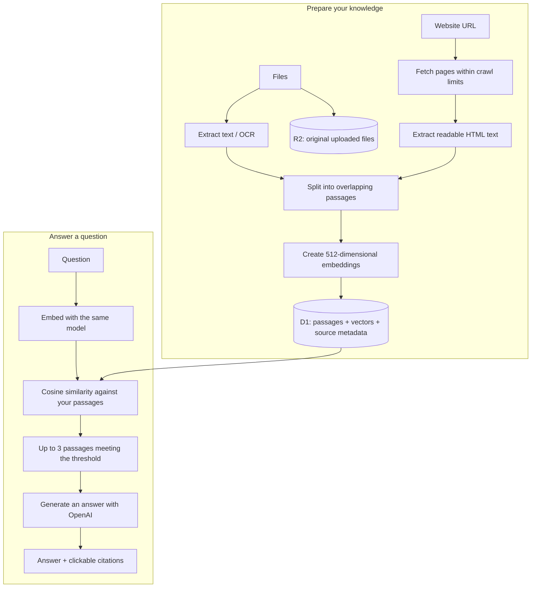
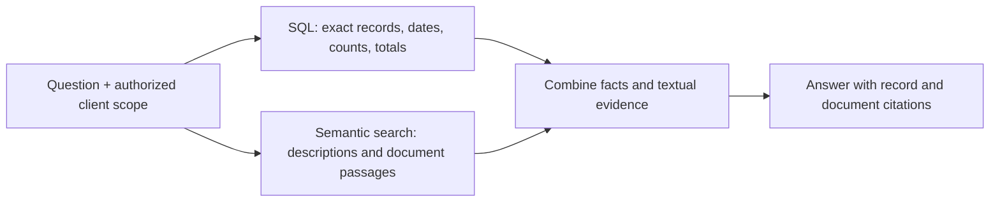

<div align="center">

# ✦ Lumen

### Your documents. Your websites. Answers you can trace.

**An end-to-end RAG workspace with browser OCR, bounded website crawling, semantic search, and inspectable citations.**

[The pipeline](#how-it-works) · [Decisions & code](#the-decisions-behind-the-pipeline) · [Run locally](#run-locally) · [Project map](#project-map) · [Limits](#limits-and-next-steps)

</div>

---

## The idea

Bring your files and webpages together, ask a question in your own words, and inspect the passages behind the answer.

Lumen implements **retrieval-augmented generation (RAG)**. It does not train a model on your files. It retrieves relevant text at question time and includes that evidence in the model's request.

| Add knowledge | Find meaning | Check the answer |
|---|---|---|
| PDF, DOCX, TXT, Markdown, CSV | Passage and question embeddings | Numbered source citations |
| Scanned PDF pages with English OCR | Exact cosine similarity | PDF page numbers |
| Public websites with crawl controls | Adjustable threshold, default 0.30 | Original website URLs |
| Persistent source collection | Up to three matching passages | Full retrieved text and scores |

**Stack:** React · TypeScript · Vinext · Cloudflare Workers · D1 · R2 · OpenAI · PDF.js · Tesseract.js · Mammoth · Cheerio

## How it works

There are two journeys: preparing your knowledge and answering a question.



### Follow one question through the system

Imagine you upload a boiler manual and ask **“What is a burner?”**

1. The browser extracts the manual's text, using OCR on sparse-text PDF pages.
2. The server divides the text into overlapping passages and embeds each passage.
3. D1 stores each passage, vector, and PDF page number. R2 stores the uploaded original.
4. When you ask, the server creates an embedding for the question.
5. It compares the question vector with your stored passage vectors and retains up to three qualifying results.
6. OpenAI receives the question and those passages, with instructions to answer from the evidence and cite it.
7. You receive an answer such as “A burner is the boiler component responsible for heating water to create steam [2].”
8. Clicking `[2]` reveals the actual passage and its source page.

The model gets the selected passages, **not the whole library**. If nothing meets the threshold, Lumen reports no matches without making an answer-generation request. The question embedding call still occurs.

## The decisions behind the pipeline

The snippets below are focused excerpts or simplified equivalents. Links point to the authoritative implementation.

### 1. Fix extraction before tuning search

**Decision:** use PDF.js for PDFs, Mammoth for Word documents, and direct text reading for text-based files. Perform file extraction in the browser.

The first difficult PDF had selectable headers over scanned page bodies. Ordinary extraction found headings but missed the definitions. No retrieval algorithm could find sentences that never reached the index.

We added English OCR for pages with fewer than **400 selectable characters** and bundled the image decoders needed to render scanned page content.

[Code: `lib/extract.ts`](lib/extract.ts)

```ts
const content = await page.getTextContent();
let text = content.items
  .map(item => "str" in item
    ? item.str + (item.hasEOL ? "\n" : " ")
    : "")
  .join("");

if (text.trim().length < 400) {
  // After rendering the PDF page to a canvas:
  const result = await ocr.recognize(canvas);
  if (result.data.text.trim().length > text.trim().length) {
    text = result.data.text;
  }
}
```

**Why:** OCR recovers words inside images. PDF.js image decoders matter too: missing JBIG2 support can leave the main scanned content out of the rendered image.

**Tradeoff:** this is a heuristic. Dense hybrid pages may not trigger OCR, recognition can be imperfect, and longer text is not always more accurate. OCR adds local processing time.

### 2. Search passages, not entire books or individual words

**Decision:** create passages of up to **1,600 characters**, with roughly **240 characters of overlap**, and preserve PDF page attribution.

One embedding for a whole manual blends too many topics. Embedding every word loses context. Overlap helps keep a statement and its explanation together.

[Code: `lib/rag.ts`](lib/rag.ts)

```ts
let end = Math.min(start + 1600, text.length);
if (end < text.length) {
  const boundary = text.lastIndexOf(" ", end);
  if (boundary > start + 1100) end = boundary;
}

result.push({
  content: text.slice(start, end).trim(),
  page: page.page,
  position: result.length,
});

const overlapStart = Math.max(start + 1, end - 240);
```

**Tradeoff:** character-based splitting is simple and inspectable but does not understand tables, headings, or definition boundaries. Chunks remain within a PDF page; overlap does not cross page boundaries.

### 3. Keep embeddings compatible

**Decision:** use `text-embedding-3-small`, **512 dimensions**, and batches of up to **32 passages**.

An embedding is a list of numbers representing aspects of text meaning. Individual coordinates are not readable labels or facts. Related meanings often produce vectors pointing in similar directions.

[Constants: `lib/rag.ts`](lib/rag.ts) · [API calls: `lib/server.ts`](lib/server.ts)

```ts
export const EMBEDDING_MODEL = "text-embedding-3-small";
export const DIMENSIONS = 512;

const result = await openai("embeddings", {
  model: EMBEDDING_MODEL,
  input: batch,
  dimensions: DIMENSIONS,
  encoding_format: "float",
});
```

The server validates response counts, ordering, dimensions, and finite numeric values. Questions use the same model and dimensions as passages.

**Tradeoff:** changing the embedding configuration requires re-embedding existing sources. Vectors from incompatible representations cannot meaningfully be compared.

### 4. Start with exact cosine search

**Decision:** keep vectors in D1 and calculate exact cosine similarity in application code, rather than introducing a separate vector database immediately.

[Code: `lib/rag.ts`](lib/rag.ts)

```ts
export function cosine(a: number[], b: number[]): number {
  if (a.length !== b.length || !a.length) {
    throw new Error("Incompatible embedding dimensions.");
  }
  let dot = 0, aa = 0, bb = 0;
  for (let i = 0; i < a.length; i++) {
    dot += a[i] * b[i];
    aa += a[i] * a[i];
    bb += b[i] * b[i];
  }
  return aa && bb
    ? Math.max(-1, Math.min(1, dot / Math.sqrt(aa * bb)))
    : 0;
}
```

The server reads records in batches of 150 and retains the best three results across batches. Owner filtering happens before ranking.

```sql
SELECT c.id, d.name, d.source_url,
       c.content, c.page, c.position, c.embedding
FROM chunks AS c
JOIN documents AS d ON d.id = c.document_id
WHERE d.owner = ? AND c.id > ?
ORDER BY c.id
LIMIT 150;
```

**Tradeoff:** search work grows linearly with the collection. The current ceiling is **3,000 passages per user**. A dedicated vector index is an upgrade for larger collections or more traffic.

### 5. Choose a threshold from evidence

**Decision:** make the cutoff adjustable and default it to **0.30**.

Cosine similarity is **not a confidence percentage**. A score of 0.30 does not mean “30% correct.” A very strict cutoff can reject a passage containing the exact answer.

Observed with one manual and the current embedding configuration:

| Question | Relevant score | Cutoff 0.50 | Cutoff 0.35 | Cutoff 0.30 |
|---|---:|---|---|---|
| Boiler-pressure question | 0.562 | Included | Included | Included |
| “What is a burner?” | 0.311 | Excluded | Excluded | Included |

We tried 0.50 and 0.35, then returned to 0.30 so the burner definition qualified. These are individual test observations, not universal benchmark scores.

```ts
// app/page.tsx
const [threshold, setThreshold] = useState(.3);

// Simplified ranking flow from lib/rag.ts
const matches = scoredPassages
  .filter(passage => passage.score >= threshold)
  .sort((a, b) => b.score - a.score)
  .slice(0, 3);
```

**Tradeoff:** lower thresholds admit less relevant material. The answer model still has to determine whether a passage supports the requested fact. “Top three” means up to three passages, not three distinct documents.

### 6. Give the model evidence and explicit boundaries

**Decision:** retrieve first, then call the Responses API with only the question and selected passages.

[Code: `app/api/ask/route.ts`](app/api/ask/route.ts)

```ts
const response = await openai("responses", {
  model: env.OPENAI_MODEL || "gpt-4.1-mini",
  store: false,
  max_output_tokens: 1400,
  instructions, // Grounding and citation rules from the route.
  input: JSON.stringify({
    question: body.question,
    sources: sources.map((s, i) => ({
      source: i + 1,
      filename: s.name,
      url: s.source_url,
      page: s.page,
      text: s.content,
    })),
  }),
});
```

The instructions require numbered citations, treating source content as untrusted data, and preserving conditions, categories, units, and inequality direction.

Why that detail? **“Above 15 PSIG” defines a lower boundary; it does not establish a maximum of 15 PSIG.** Finding the right number is not the same as interpreting it correctly.

**Tradeoff:** citations provide traceability, not proof. A reader should inspect the supporting text. `store: false` is a request setting, not a blanket statement about provider retention policies.

### 7. Persist sources and reindex without unnecessary duplicates

**Decision:** D1 stores text, vectors, and metadata; R2 stores uploaded originals. Website imports store extracted text and URLs, not full offline website copies.

[Schema: `db/schema.ts`](db/schema.ts) · [Routes: `app/api/documents/route.ts`](app/api/documents/route.ts)

```text
documents
  id, owner, name, hash, bytes, chunks, words,
  created_at, source_url

chunks
  id, document_id, position, page, content, embedding
```

- File identity uses a SHA-256 hash of the original bytes.
- Website identity uses a hash of the normalized URL.
- Unchanged extracted passages are skipped.
- Improved extraction or changed website text replaces existing passages and vectors.
- Deleting a document removes its chunks through the foreign-key relationship.

This allowed the same scanned PDF to be reindexed after OCR improved, without adding a second copy to the collection.

### 8. Make website crawling bounded and visible

**Decision:** fetch public HTTPS HTML without a headless browser. Let the user control page count, depth, and scope.

[Queue and UI: `components/website-importer.tsx`](components/website-importer.tsx) · [Fetching: `lib/crawl.ts`](lib/crawl.ts) · [Parsing: `lib/website.ts`](lib/website.ts)

| Control | Default | Behavior |
|---|---|---|
| Maximum pages | 5 | 1–25 attempted pages, including skipped pages |
| Link depth | 1 | 0–3; zero means the starting page only |
| Scope | Same website | Same hostname, optionally restricted to the starting path |
| Stop | — | Finishes the current page and preserves completed imports |

```ts
const queue = [{ url: root, depth: 0 }];
while (queue.length && visited < limit && !stop.current) {
  const item = queue.shift()!;
  // Fetch, extract, and index one page.
  // Enqueue discovered links only when item.depth < depth.
}
```

Depth counts link-following steps, not slashes in a URL. A low page limit can be exhausted before deeper links are reached.

The server checks URL format, DNS addresses, and redirect scope. It reads robots.txt and honors supported crawl delays and noindex/nofollow directives. Cheerio removes scripts and common noise without executing JavaScript. User cookies and API credentials are not forwarded to crawled sites.

**Tradeoff:** keep the tab open while importing. JavaScript-only, login-only, and crawler-blocked content may be skipped. Runtime network restrictions remain important alongside application URL/DNS checks. Imported pages are snapshots; reimport them to refresh their content.

## Try it and inspect the evidence

1. Upload a document or choose **Add a website**.
2. For a first website import, select two pages and depth one.
3. Watch the indexed-passage count grow.
4. Ask a specific question about the content.
5. Click a citation to inspect its text, page or URL, and similarity score.
6. Raise the threshold and repeat the question to see which evidence disappears.

Local verification included a two-page Jack Jaffa import with a cited answer, and text extraction from the Dokkan Battle Wiki. Website availability can change. The private development PDF and local data are not distributed in this repository.

## Run locally

### Prerequisites

- Node.js **24** and npm.
- An OpenAI API key with model access and available API quota.
- An environment capable of running the Cloudflare local runtime.

This is a **Vinext / Cloudflare Workers** application with Sites authentication integration, not a conventional `next dev` deployment.

### Install and configure

```sh
npm ci
```

Set `OPENAI_API_KEY` through your shell or secret manager before starting development. For example, PowerShell 7 can prompt without placing the key in the command itself:

```powershell
$env:OPENAI_API_KEY = Read-Host 'OpenAI API key' -MaskInput
```

Never place the key in client code or Git. Development injects the existing environment variable into the local Worker only when serving locally. Production secrets must be configured separately on the host.

If a restricted Windows environment cannot write to npm's default cache:

```powershell
npm.cmd ci --cache .sites-runtime/npm-cache
```

### Build and initialize a fresh local database

```sh
npm run build

node --import ./scripts/sites-env.mjs ./node_modules/wrangler/bin/wrangler.js d1 execute DB --local --config dist/server/wrangler.json --persist-to .wrangler/state --file drizzle/0000_elite_franklin_storm.sql

node --import ./scripts/sites-env.mjs ./node_modules/wrangler/bin/wrangler.js d1 execute DB --local --config dist/server/wrangler.json --persist-to .wrangler/state --file drizzle/0001_marvelous_radioactive_man.sql

npm run dev -- --hostname 127.0.0.1
```

Apply each SQL file **once**, in order. For an existing database, apply only migrations it has not already received. These are direct SQL execution commands, not idempotent migration tracking.

Open the printed URL. If sign-in is needed, visit `/signin-with-chatgpt?return_to=/` on that local server. Portable development uses a test identity; it is not production authentication. Keep the development server private.

### Deployment and bundled assets

`.openai/hosting.json` identifies the original Sites project and the logical DB/BUCKET bindings. Cloning this repository does not grant access to that project or its data. A new deployment needs authorized hosting, storage, migrations, authentication, and server secrets.

The website-import addition was verified locally; publishing it to the original Site was blocked by access to that account. The hosted version may differ from this checkout.

PDF.js and Tesseract workers, decoders, fonts, and OCR language assets are bundled in `public/`. Refresh matching assets when upgrading dependencies, and preserve their license files.

## Verify it

Checks that do not call OpenAI:

```sh
node node_modules/typescript/bin/tsc --noEmit
node --experimental-strip-types scripts/check-rag.ts
node --experimental-strip-types scripts/check-website.ts
npm run build
```

Integration checks use the running local server and **billable OpenAI calls**. They create temporary records and clean up their own records afterward:

```sh
node scripts/check-integration.mjs
node scripts/check-website-integration.mjs
```

| Check | Coverage |
|---|---|
| RAG | Chunk coverage, page attribution, cosine, top-three ranking, strict thresholds |
| Website | URL/private-address filtering, scope, robots rules, extraction, link deduplication, size cap |
| Document integration | Authentication, persistent upload, deduplication, embeddings, cited answers, validation, deletion |
| Website integration | URL attribution, persistence, deduplication, changed-page reindexing, live retrieval |

The document integration script uses `localhost:5173`; the website check uses `127.0.0.1:5173`. If localhost resolves to IPv6 while the server listens on IPv4, set the document script's `base` to the printed server URL.

## Project map

```text
app/
  page.tsx                     Collection, questions, citations, settings
  globals.css                  Responsive styling
  api/documents/route.ts        Source CRUD and indexing
  api/ask/route.ts              Retrieval and answer generation
  api/crawl/route.ts            Authenticated page-fetch endpoint
components/website-importer.tsx Crawl controls, queue, progress, stopping
lib/
  extract.ts                   Browser extraction and OCR
  rag.ts                       Chunking, embedding constants, cosine ranking
  server.ts                    Authentication, storage, OpenAI requests
  website.ts                   URL rules, robots policy, HTML extraction
  crawl.ts                     DNS checks, redirects, bounded fetching
db/schema.ts                   Documents and chunks
drizzle/                       Schema migrations and snapshots
scripts/check-*                Focused verification scripts
public/                        Bundled PDF and OCR assets
```

## Limits and next steps

| Area | Current limit |
|---|---|
| Uploaded files | 15 MB; PDF maximum 300 pages |
| Extracted text | 600,000 characters per upload |
| Passages | 500 per upload; 3,000 per user collection |
| Website pages | 2 MB HTML; first 60,000 text characters per page |
| Crawl | 25 attempted pages; 600,000 text characters per import |
| OCR | English; sparse selectable-text pages |
| Retrieval | Exact cosine; up to three qualifying passages |
| Persistence | Sources persist; conversation history does not |
| Collections | One source collection per authenticated user |

Three passages work better for targeted questions than exhaustive summaries of large manuals. Citations identify evidence but do not guarantee the answer is correct. CSVs are text sources, not relational tables: use SQL for accurate totals and counts.

Possible upgrades include hybrid keyword/vector search, reranking, structure-aware chunking, neighboring-passage expansion, a dedicated vector index, and durable background crawling. These are **not implemented** in this version.

## Extending this to clients, properties, and violations

That workflow should combine structured database queries with document retrieval. It is an architectural extension, not an existing feature.



For a count, let the database calculate the result:

```sql
-- Illustrative future schema: these tables do not exist in Lumen today.
SELECT COUNT(*) AS open_count
FROM violations AS v
JOIN properties AS p ON p.id = v.property_id
WHERE p.client_id = :authorized_client_id
  AND v.status = 'OPEN';
```

For “What does the inspection report say about this violation?”, select the permitted client's linked documents, then search their passages. A repair report and an agency closure status are different facts; an answer should preserve that distinction.

SQL supplies exact relationships, filters, and calculations. Embeddings help retrieve descriptive evidence. The server must enforce access scope in both paths.

## References

- [OpenAI embeddings](https://developers.openai.com/api/docs/guides/embeddings)
- [OpenAI text generation](https://developers.openai.com/api/docs/guides/text)
- [Cheerio documentation](https://cheerio.js.org/docs/intro)

---

<div align="center">

**Less searching. More understanding.**

Built to make the path from source text to answer visible.

</div>
